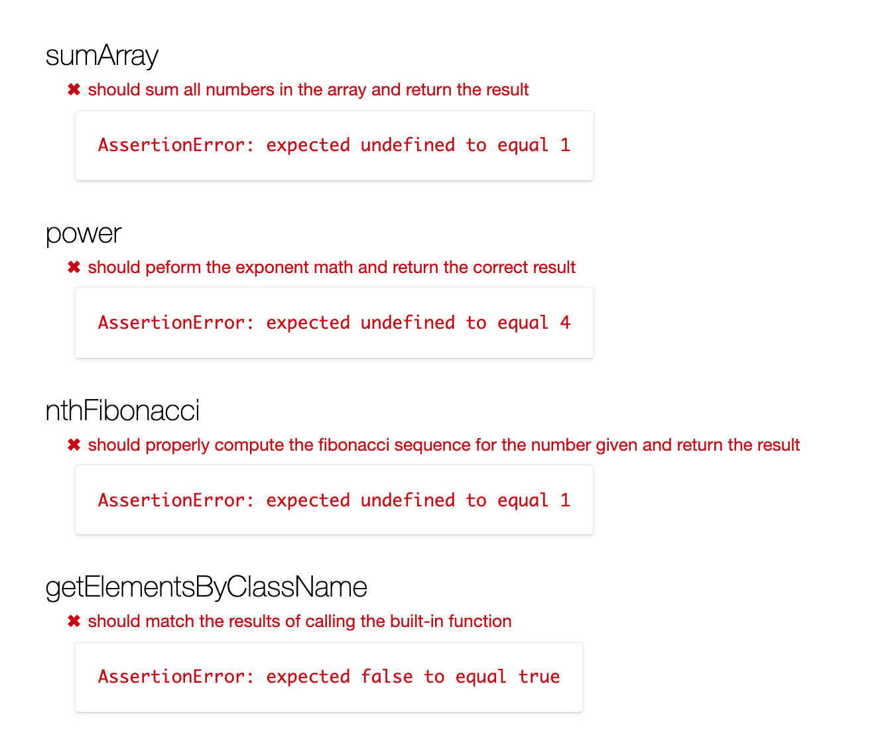
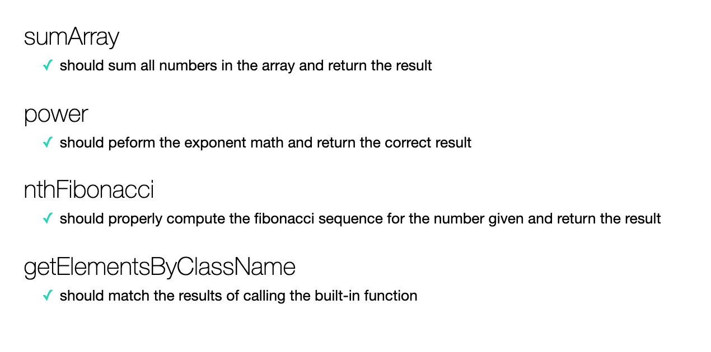

# Hack Reactor: Recursion in JavaScript

You're here to solidify your understanding of recursion -- a fundamental programming concept -- in JavaScript.

*IMPORTANT*: Completion of this workshop is no guarantee of admission into the Hack Reactor immersive program, nor does it have any influence in the admissions process.

## Prerequisites

This workshop is designed for folks in the midst of studying intermediate-level JavaScript who have a few months of foundational experience. You will be expected to understand the basics of the Document Object Model (DOM) as applied to HTML.

## Textbook

No textbook is required for this workshop. All materials are included in this GitHub repo.

## Technical requirements

Laptop, Google Chrome browser and a text editor. If you do not have a text editor, we recommend Visual Studio Code, Sublime Text, or Atom.

# How to use this repository

### Let's get started...

Run the SpecRunner.html file in a browser. This document currently shows 4 failing tests.

- The `spec` folder holds all the failing tests that are being displayed in SpecRunner.html.
- The `src` folder holds the functions that are being called to run the tests.
- Your task is to edit the files in `src` to complete the functions and get the tests to pass.
- These files are just javascript files so you can use `console.log` to help debug and inspect these functions.

## Recursion Review

Recursion is a technique for solving problems wherein a function makes calls to itself. By doing so, it can complete a small amount of the processing, and delegate the rest of the problem to the recursive calls.

Consider the following function:

```js
var eat = function(meal){
  console.log('meal before bite:', meal);
  console.log('now eating', meal.pop());
  if(meal.length){
    eat(meal);
  } else {
    console.log('done with the meal!');
  }
}
```

Which produces this output:

```js
eat(['soup', 'potatoes', 'fish']);
// => meal before bite: ["soup", "potatoes", "fish"]
// => now eating fish
// => meal before bite: ["soup", "potatoes"]
// => now eating potatoes
// => meal before bite: ["soup"]
// => now eating soup
// => done with the meal!
```

You can use recursion on problems where smaller parts of the problem look the same as the larger problem as a whole.

In this sprint, you'll be practicing writing recursive functions, building up to  the reimplementation of a JavaScript browser method that involves recursion (getElementsByClassName). In so doing, don't use the things you're reimplementing, or any other built-in shortcuts that make these problems trivial. (You'll probably know if you're cheating, but feel free to ask us if you're not sure.)

(Curious fact: many browsers don't have any of these functions in them, and people do need to reimplement them.  When we reimplement new browser functionality in older browsers, it's called a "polyfill".)

## Exercises

More detailed instructions and examples for each exercise can be found in the individual `.js` files in the `src` folder.

### 1: sumArray

- [ ] Implement `sumArray` with your own code in `src/sumArray.js`

### 2: power

- [ ] Implement `power` with your own code in `src/power.js`

### 3: nthFibonacci

- [ ] Implement `nthFibonacci` with your own code in `src/nthFibonacci.js`

### 4: getElementsByClassName

- [ ] Implement `getElementsByClassName` with your own code in `src/getElementsByClassName.js`
  - [ ] You should use `document.body`, `element.childNodes`, and `element.classList`
- NOTE: You may also use methods from the [underscore](https://underscorejs.org) library for assitance, but are not required to do so.
- You can view the MDN documentation for getElementsByClassName [here](https://developer.mozilla.org/en/docs/Web/API/Document/getElementsByClassName)

#### Failing Tests Example



#### Passing Tests Example



### Don't forget..

You should throroughly read all of code in front of you and aim to understand line-by-line what is happening.